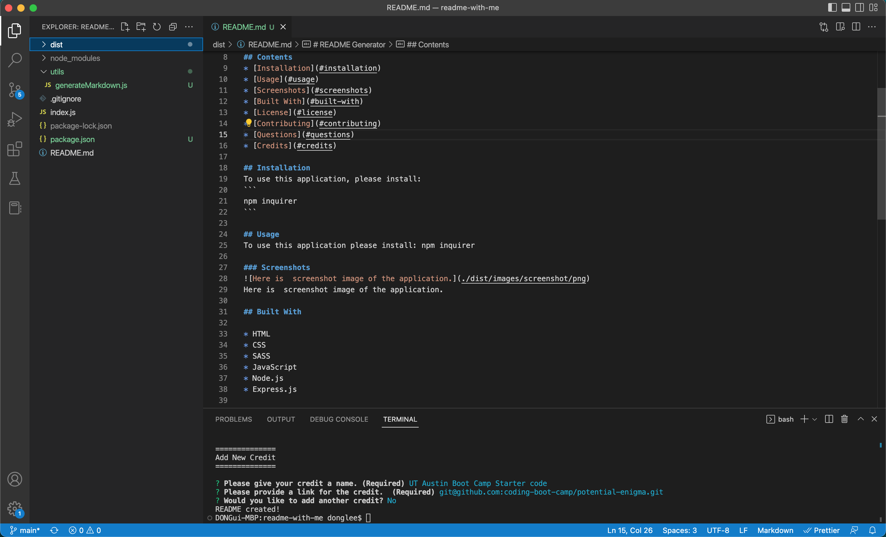

# README With Me
[](https://github.com/Donglee0415/readme-generator/issues) [](https://github.com/Donglee0415/readme-generator/graphs/contributors) 

## Description
A Node.js application that will help you generate a professional README.
            
View the deployed page at [README Generator](https://donglee0415.github.io/README-with-me/).
## Contents
* [Installation](#installation)
* [Usage](#usage)
* [Screenshots](#screenshots)
* [Built With](#built-with)
* [License](#license)
* [Contributing](#contributing)
* [Questions](#questions)
* [Credits](#credits)

## Installation
To use this application, please install: 
```
npm inquirer
```
    
## Usage
To use this application please install: npm inquirer 
    
### Screenshots

Here is  screenshot image of the application.

## Built With

* HTML
* CSS
* SASS
* JavaScript
* Node.js
* Express.js
    
## License
This application is licensed under the MIT license.
    
## Contributing
There are no guidelines for contributing at this time.
    
## Questions
If you have any questions about the repo, please [open an issue](https://github.com/Donglee0415/README-with-me/issues) or contact me via email at dn.lee0415@gmail.com. You can find more of my work on my GitHub, [Donglee0415](https://github.com/Donglee0415/).
    
## Credits
* [UT Austin Boot Camp Starter code](git@github.com:coding-boot-camp/potential-enigma.git)

    
